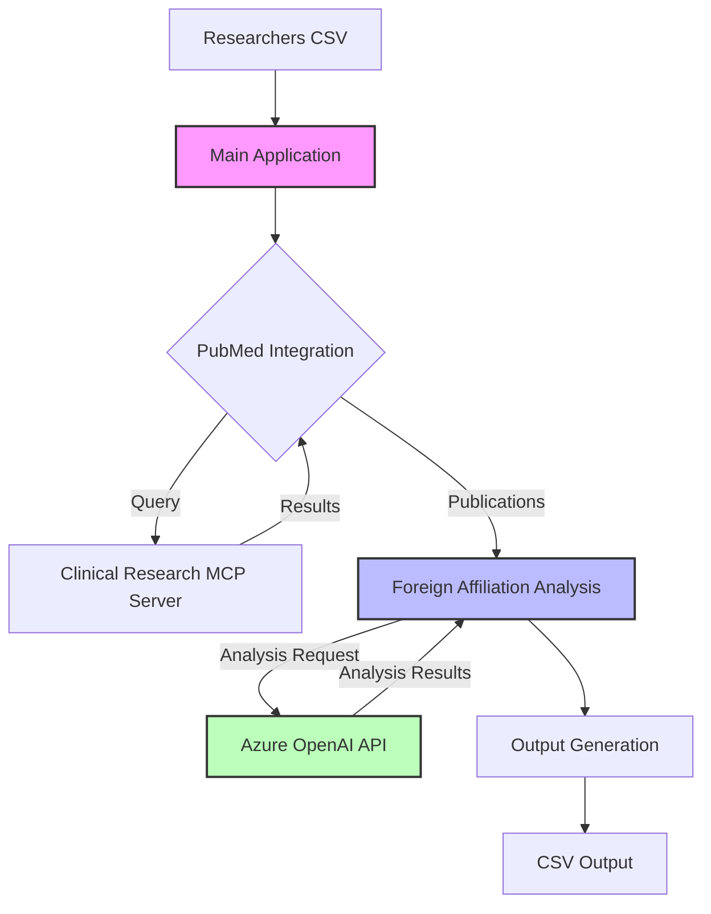
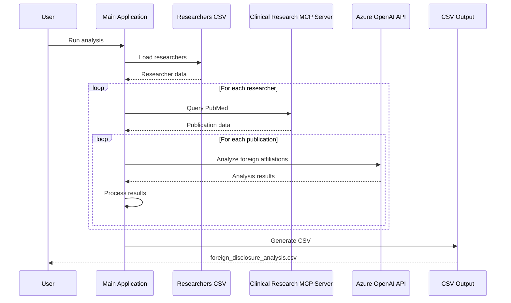
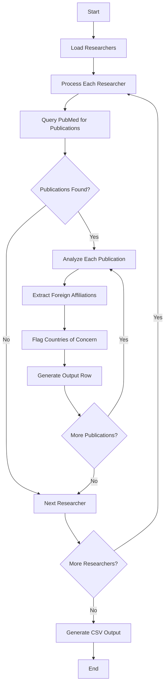
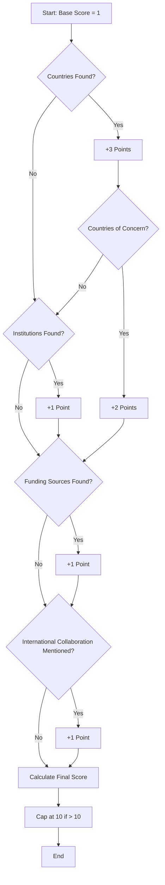
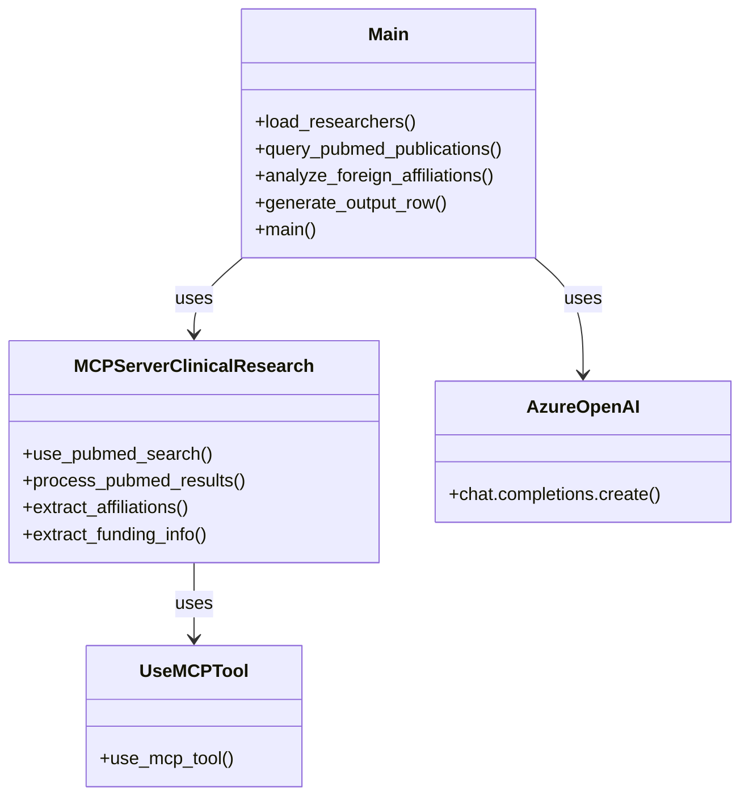

# Foreign Disclosure Analysis Tool for BCH Researchers

This tool analyzes PubMed publications for Boston Children's Hospital (BCH) researchers to identify foreign affiliations and collaborations, with a particular focus on Russia, North Korea, Iran, and China. The analysis results are output to a CSV file with specific fields.

## Overview

The solution uses the Azure OpenAI API and the Clinical Research MCP Server to analyze PubMed publications for foreign disclosure requirements. It processes a list of BCH researchers from a CSV file, queries PubMed for their publications, analyzes the publications for foreign affiliations, and outputs the results to a CSV file.

## System Architecture



## Data Flow



## Features

- Dynamic loading of researcher data from CSV
- PubMed integration via Clinical Research MCP Server
- Foreign affiliation analysis using Azure OpenAI API
- Special flagging for countries of concern (Russia, North Korea, Iran, China)
- Confidence scoring for foreign involvement
- CSV output with detailed information

## Requirements

- Python 3.9+
- Azure OpenAI API access
- Clinical Research MCP Server access

## Installation

1. Clone the repository:

   ```
   git clone https://github.com/BCH-IDHA/foreign-disclosure-analysis.git
   cd foreign-disclosure-analysis
   ```

2. Install the required dependencies:

   ```
   pip install -r requirements.txt
   ```

3. Configure the `.env` file with your Azure OpenAI API credentials:
   ```
   AZURE_OPENAI_API_ENDPOINT=your_endpoint
   AZURE_OPENAI_API_KEY=your_api_key
   AZURE_OPENAI_API_VERSION=your_api_version
   AZURE_OPENAI_DEPLOYMENT=your_deployment_name
   AZURE_OPENAI_MODEL=your_model_name
   ```

## Usage

1. Prepare your researchers CSV file with the following format:

   ```
   Researcher last name, Research first name
   Smith, John
   Doe, Jane
   ```

2. Run the analysis:

   ```
   python main.py
   ```

3. Review the output in `foreign_disclosure_analysis.csv`

## Analysis Process



## Output Format

The output CSV file contains the following columns:

- **publication_name**: The name of the journal where the research was published
- **research_title**: The title of the research publication
- **author_name**: The name of the BCH researcher
- **organization_affiliation**: The organization affiliation (Boston Children's Hospital)
- **countries_of_origin**: Countries of origin/association
- **flagged**: Indicates whether the publication has any countries of concern (Yes/No)
- **flagged_countries**: Lists the specific countries of concern that were flagged
- **confidence_score**: Confidence score (1-10) regarding foreign involvement
- **funding_source**: Funding sources for the research

## Confidence Scoring Algorithm



## Project Structure

- `main.py`: Main script for the analysis
- `mcp_server_clinical_research.py`: Wrapper for the Clinical Research MCP Server
- `use_mcp_tool.py`: Wrapper for the MCP tool functionality
- `requirements.txt`: Required Python dependencies
- `researchers.csv`: Input file containing BCH researcher names
- `solution-plan.md`: Implementation plan and progress tracking
- `README.md`: Project documentation

## Component Relationships



## Development

This application requires access to both the Azure OpenAI API and the Clinical Research MCP Server. It will not run in a simulated or mock mode. If either service is unavailable, the application will fail with appropriate error messages.

### Requirements

1. Valid Azure OpenAI API credentials configured in the .env file
2. Access to the Clinical Research MCP Server
3. Proper network connectivity to both services

The application performs strict validation of these requirements and will not proceed if they are not met.

## License

[Specify your license here]

## Acknowledgments

- Boston Children's Hospital
- Azure OpenAI API
- Clinical Research MCP Server
